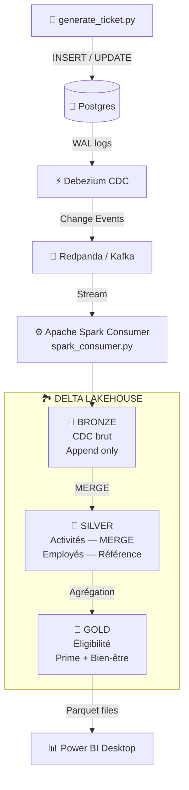

# Infrastructure Sport Data Solution

## Architecture Medallion (Delta Lake)



| Couche | Contenu | Chemin Delta |
|--------|---------|-------------|
| **Bronze** | Événements CDC bruts (append-only) | `/opt/spark/delta/bronze/activities` |
| **Silver** | Activités nettoyées (MERGE/upsert) + Employés (référence) | `/opt/spark/delta/silver/` |
| **Gold** | Éligibilité : Prime sportive (5% salaire) + Journées bien-être (≥15 activités) | `/opt/spark/delta/gold/employee_eligibility` |

### Règles métier (Gold)

- **Prime sportive** : 5% du salaire annuel brut pour les salariés dont le mode de déplacement déclaré est sportif (Marche/running, Vélo/Trottinette/Autres) ET qui ont des activités de déplacement sportif enregistrées.
- **5 journées bien-être** : Accordées aux salariés ayant au minimum 15 activités physiques externes dans l'année.


## Prérequis

- [Docker](https://www.docker.com/) et [Docker Compose](https://docs.docker.com/compose/)
- Python 3.13.1+

## Installation

1. Clonez ce dépôt :
	```bash
	git clone <url-du-repo>
	cd Infrastructure-Sport-Data-Solution
	```
2. Installez les dépendances Python :
	```bash
	python -m venv venv
	venv\Scripts\activate  # Windows
	pip install -r requirements.txt
	```

## Lancement de l'infrastructure

Lancez tous les services (PostgreSQL, Redpanda, Debezium, pgAdmin, Spark) :

```bash
docker-compose up -d
```

## Accès rapides

- **pgAdmin** : [http://localhost:8081](http://localhost:8081) (login: admin@example.com / admin)
- **Redpanda Console** : [http://localhost:8080](http://localhost:8080)
- **Spark Master UI** : [http://localhost:9090](http://localhost:9090)

## Configuration

Adaptez les fichiers `database.ini` et `debezium.json` selon vos besoins.


## Pipeline complet

### 1. Debezium (CDC)

Enregistrer le connecteur Debezium pour capturer les changements PostgreSQL :

```bash
Get-Content debezium.json | docker exec -i debezium-connector bash -c "curl -X POST -H 'Content-Type: application/json' http://localhost:8083/connectors -d @-"
```
verification 
```bash
docker exec debezium-connector curl -s http://localhost:8083/connectors/postgresql-connector/status | ConvertFrom-Json | ConvertTo-Json -Depth 10
```

supprimer le connecteur si besoin :
```bash
docker exec -i debezium-connector curl -X DELETE http://localhost:8083/connectors/postgresql-connector
```


### 2. Bronze : Streaming Kafka → Delta Lake

Copier et lancer le consumer Spark (ingestion streaming dans la couche Bronze) :

```bash
docker cp .\spark_consumer.py spark-master:/opt/spark/work/spark_consumer.py
docker exec spark-master /opt/spark/bin/spark-submit --packages org.apache.spark:spark-sql-kafka-0-10_2.12:3.5.0,io.delta:delta-spark_2.12:3.2.0 /opt/spark/work/spark_consumer.py
```

Les données CDC brutes sont persistées dans `/opt/spark/delta/bronze/activities`.

### 3. Pipeline Medallion : Bronze → Silver → Gold → Power BI

Lancement en une commande (prépare les données de référence, exécute le processeur Medallion, exporte en Parquet) :

```powershell
.\start_powerbi_export.ps1                    # Traitement unique
.\start_powerbi_export.ps1 -Mode watch        # Traitement continu (60s)
.\start_powerbi_export.ps1 -Mode watch -Interval 120
```

Ou manuellement :

```bash
# Préparer les données de référence (Excel → CSV)
python prepare_reference_data.py

# Copier et lancer le processeur Medallion
docker cp .\spark_medallion_processor.py spark-master:/opt/spark/work/spark_medallion_processor.py
docker exec spark-master /opt/spark/bin/spark-submit --packages io.delta:delta-spark_2.12:3.2.0 /opt/spark/work/spark_medallion_processor.py --mode single
```

### 4. Power BI Desktop

Les fichiers Parquet sont générés dans `powerbi_data/` :
- `employee_eligibility.parquet/` : Table Gold — éligibilité prime sportive + journées bien-être
- `activities.parquet/` : Table Silver — détail des activités sportives

Dans Power BI Desktop : **Accueil > Obtenir les données > Parquet** → sélectionner le fichier `.parquet`.

### Vérifier les données Delta Lake

Pour lire les données de toutes les couches (Bronze, Silver, Gold) :

```bash
docker cp .\delta_reader.py spark-master:/opt/spark/work/delta_reader.py
docker exec spark-master /opt/spark/bin/spark-submit --packages io.delta:delta-spark_2.12:3.2.0 /opt/spark/work/delta_reader.py
```


docker compose build --no-cache spark-submit-job
docker compose up spark-submit-job