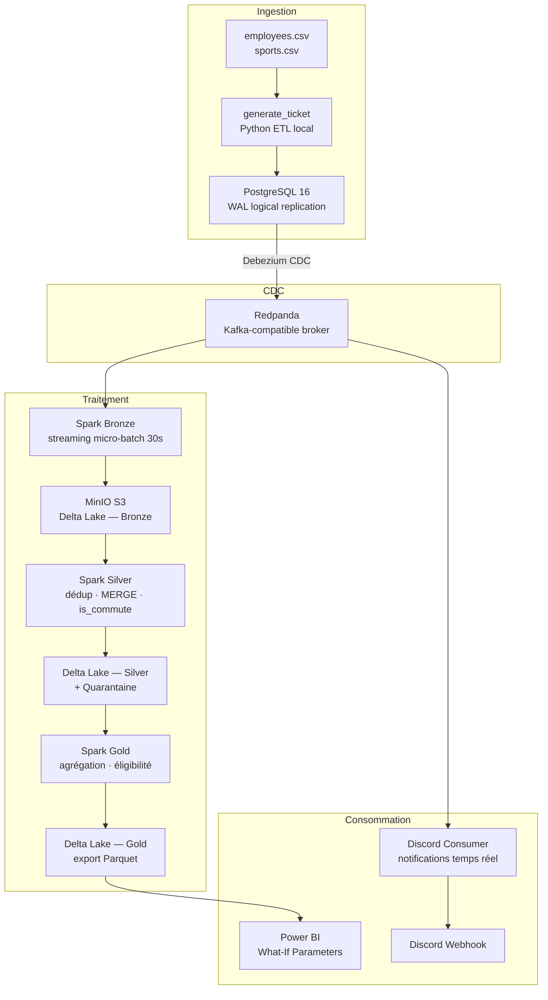

# Infrastructure Sport Data Solution

Pipeline de données en temps réel pour le calcul d'éligibilité aux avantages sportifs (prime sportive et journées bien-être) des employés.

> **Projet OpenClassrooms** — Le jeu de données est volontairement petit (~161 employés, ~500 tickets / génération).
> La stack est dimensionnée pour démontrer la maîtrise d'une architecture Data Engineering moderne, pas pour répondre à un besoin de volumétrie.


---

## Table des matières

1. [Architecture](#architecture)
2. [Flux de données détaillé](#flux-de-données-détaillé)
3. [Services Docker](#services-docker)
4. [Règles métier](#règles-métier)
5. [Qualité des données](#qualité-des-données)
6. [Prérequis](#prérequis)
7. [Installation et lancement](#installation-et-lancement)
8. [Structure du projet](#structure-du-projet)
9. [Tests](#tests)
10. [Monitoring et interfaces](#monitoring-et-interfaces)
11. [Variables d'environnement](#variables-denvironnement)
12. [Choix techniques](#choix-techniques)

---

## Architecture



### Architecture Medallion (Delta Lake)

| Couche | Contenu | Chemin S3 |
|--------|---------|-----------|
| **Bronze** | Événements CDC bruts, append-only | `s3a://delta-lake/bronze/activities` |
| **Silver / Activities** | Dédupliquées, MERGE upsert/delete, `is_commute` | `s3a://delta-lake/silver/activities` |
| **Silver / Employees** | Données RH de référence nettoyées | `s3a://delta-lake/silver/employees` |
| **Quarantaine** | Enregistrements invalides avec raison de rejet | `s3a://delta-lake/quarantine/activities` |
| **Gold** | Agrégats par employé + flags d'éligibilité | `s3a://delta-lake/gold/employee_eligibility` |
| **Power BI** | Export Parquet final | `s3a://powerbi/` |

---

## Flux de données détaillé

### 1 — Génération des tickets (`generate_ticket/`)

1. Chargement des fichiers `employees.csv` et `sports.csv`
2. Validation Pydantic (`EmployeeRecord`) et nettoyage
3. Filtrage des employés éligibles → 3 groupes : sport seul, transport seul, les deux
4. Génération de 500 tickets synthétiques avec graine reproductible (NumPy RNG)
   - Transport actif (commute) : horaires 7h–10h, jours ouvrables
   - Sport externe : horaires 5h–22h, tous jours
5. Insertion batch dans PostgreSQL (table `activities`)

### 2 — Capture des changements (CDC)

- **Debezium** lit le WAL PostgreSQL (plugin `pgoutput`, réplication logique)
- Chaque INSERT / UPDATE / DELETE est publié en JSON sur le topic Redpanda `topic_activities.public.activities`
- Transformation `ExtractNewRecordState` : dépliage de l'enveloppe Debezium, flag `__deleted` pour les suppressions

### 3 — Couche Bronze (Spark Structured Streaming)

- Lecture du topic Kafka en micro-batch de 30 secondes
- Parsing du JSON Debezium (`schemas.py`)
- Écriture append-only dans Delta Lake Bronze

### 4 — Couche Silver (Spark batch)

- **Dédoublonnage** : conservation du dernier enregistrement par `activity_id`
- **Enrichissement** : ajout de la colonne booléenne `is_commute` (préfixe `"Commute to work"`)
- **Intégrité référentielle** : vérification que l'`employee_id` existe dans Silver Employees
- **Qualité des données** : validation de 7 règles structurelles + contrôle des outliers de distance (→ quarantaine si KO)
- **MERGE** Delta Lake : upsert + gestion des suppressions CDC (`__deleted = "true"`)

### 5 — Couche Gold (Spark batch)

Agrégation par employé :

| Colonne calculée | Description |
|-----------------|-------------|
| `total_activities` | Total d'activités |
| `total_commute_activities` | Activités domicile-travail |
| `total_external_activities` | Activités sportives externes |
| `total_distance_m` | Distance cumulée (mètres) |
| `total_elapsed_time_s` | Durée cumulée (secondes) |
| `is_eligible_prime_sportive` | Flag éligibilité prime sportive |
| `is_eligible_journees_bienetre` | Flag éligibilité journées bien-être |

Export Parquet vers MinIO pour consommation Power BI.

### 6 — Notifications Discord

- Consumer Kafka indépendant (polling configurable, défaut 300s)
- Formatage des activités en embeds Discord
- Notification sur le dernier batch reçu

---

## Services Docker

| # | Service | Rôle | Port(s) |
|---|---------|------|---------|
| 1 | `postgres` | Base source — WAL logical replication | 5432 |
| 2 | `postgres-init` | Création du schéma (one-shot) | — |
| 3 | `minio` | Stockage objet S3-compatible | 9000, 9001 |
| 4 | `minio-init` | Création des buckets (one-shot) | — |
| 5 | `redpanda` | Broker Kafka-compatible | 19092 |
| 6 | `redpanda-console` | UI web topics/messages | 8080 |
| 7 | `debezium` | Connecteur CDC PostgreSQL | 8083 |
| 8 | `debezium-init` | Enregistrement du connecteur (one-shot) | — |
| 9 | `discord-consumer` | Notifications Kafka → Discord | — |
| 10 | `spark-master` | Spark cluster master | 7077, 9090 |
| 11 | `spark-worker` | Worker (2 cores, 2 GB) | 9091 |
| 12 | `spark-consumer` | Bronze — Kafka → Delta Lake (streaming) | — |
| 13 | `spark-submit-job` | Silver + Gold — transformations batch | — |
| 14 | `prometheus` | Collecte des métriques | 9099 |
| 15 | `grafana` | Dashboards de supervision | 3000 |

---

## Règles métier

Les règles sont centralisées dans [`spark_job/services/business_rules.py`](spark_job/services/business_rules.py) — source unique de vérité pour le pipeline **et** les tests.

### Prime sportive

L'employé est éligible si :
- Son mode de transport appartient à `["Marche/running", "Vélo/Trottinette/Autres"]`
- Il a enregistré au moins **1 activité domicile-travail** (`is_commute = true`)

> Montant = `salaire_brut × taux` — le taux est un **What-If Parameter Power BI** (non calculé dans le pipeline).

### Journées bien-être

L'employé est éligible si :
- Il a au moins **15 activités sportives externes**

> Le nombre de journées accordées est également un **What-If Parameter Power BI**.

---

## Qualité des données

Les enregistrements Silver passent par 7 règles structurelles + un contrôle d'outliers de distance. Les enregistrements invalides sont isolés dans la table de **quarantaine** avec la raison de rejet et l'horodatage.

| Règle | Condition de rejet |
|-------|--------------------|
| `id_null` | `id` est null |
| `employee_id_null` | `employee_id` est null |
| `sport_type_null_or_empty` | `sport_type` est null ou vide |
| `elapsed_time_invalid` | `elapsed_time` est null ou ≤ 0 |
| `start_datetime_null` | `start_datetime` est null |
| `distance_negative` | `distance` < 0 |
| `distance_outlier` | Distance > seuil par sport (voir ci-dessous) |

**Seuils de distance par sport :**

| Sport | Distance max |
|-------|-------------|
| Marche/running | 15 km |
| Vélo/Trottinette/Autres | 25 km |

---

## Prérequis

- [Docker Desktop](https://www.docker.com/products/docker-desktop/) avec Docker Compose v2
- [Python 3.11+](https://www.python.org/downloads/)
- ~6 Go de RAM disponibles pour les conteneurs
- Un webhook Discord (pour les notifications)

---

## Installation et lancement

```bash
git clone https://github.com/Xantos07/Infrastructure-Sport-Data-Solution.git
cd Infrastructure-Sport-Data-Solution
```

**1. Configurer les variables d'environnement :**

```bash
cp .env.example .env
# Éditer .env et renseigner au minimum DISCORD_WEBHOOK_URL
```

**2. Copier la configuration Debezium :**

```bash
cp config/debezium.example.json config/debezium.json
```

**3. Lancer le pipeline complet :**

```bash
sh starter.sh
```

Ce script exécute dans l'ordre :

1. Démarrage des 15 services Docker (attente de la disponibilité de PostgreSQL)
2. Création d'un environnement virtuel Python + installation des dépendances
3. Upload des CSV de référence vers MinIO (`prepare_reference_data.py`)
4. Génération de 500 tickets d'activités dans PostgreSQL (`generate_ticket/main.py`)
5. Debezium capture les insertions et les publie sur Redpanda
6. Spark Bronze ingère le stream en Delta Lake (micro-batch 30s)
7. Spark Silver/Gold transforme, agrège et exporte vers Power BI

---

## Structure du projet

```
Infrastructure-Sport-Data-Solution/
│
├── config/                          # Configuration partagée
│   ├── configuration.py             # Pydantic BaseSettings (4 classes)
│   ├── connect.py                   # Fabrique de connexion PostgreSQL
│   ├── logger.py                    # Fabrique de logger
│   └── debezium.example.json        # Template du connecteur CDC
│
├── generate_ticket/                 # ETL local — génération de tickets
│   ├── main.py                      # Orchestrateur du pipeline
│   ├── constants.py                 # Constantes métier (modes de transport, commentaires)
│   ├── ingestion/csv_loader.py      # Chargement et fusion des CSV
│   ├── transformation/
│   │   ├── cleaner.py               # Validation, filtrage éligibilité, groupement
│   │   └── ticket_generator.py      # Génération synthétique (NumPy RNG seedé)
│   ├── analytics/statistics.py      # Reporting des pourcentages d'éligibilité
│   ├── repository/activity_repository.py  # Insert batch PostgreSQL (psycopg2)
│   ├── models/ticket.py             # Dataclass ActivityTicket
│   └── unit_test/                   # ~40 tests (cleaner, ticket_gen, stats)
│
├── spark_job/                       # Jobs Spark — Architecture Medallion
│   ├── schemas.py                   # StructTypes PySpark (Debezium, CSV)
│   ├── spark_medallion_processor.py # Point d'entrée Silver/Gold (single/watch mode)
│   ├── prepare_reference_data.py    # Upload CSV → MinIO
│   ├── medallion_processor/
│   │   ├── medallion_layer.py       # Classe abstraite (helpers read/write/log)
│   │   ├── bronze_processor.py      # Streaming Kafka → Delta Lake
│   │   ├── base_silver_processor.py # Normalisation des noms de colonnes
│   │   ├── silver_activity_processor.py   # Dédup + MERGE + is_commute
│   │   ├── silver_employees_processor.py  # Nettoyage données de référence
│   │   ├── data_quality_processor.py      # Règles de validation + quarantaine
│   │   └── gold_processor.py        # Agrégation + flags d'éligibilité
│   ├── services/
│   │   ├── business_rules.py        # Source unique des règles métier
│   │   ├── services.py              # Fonctions utilitaires
│   │   └── bronze_monitor.py        # Health checks Delta Lake
│   ├── entrypoint_bronze.sh         # spark-submit pour le streaming Bronze
│   ├── entrypoint_silver_gold.sh    # spark-submit pour Silver/Gold
│   ├── unit_test/test_medallion_processor.py  # ~40 tests (règles métier)
│   ├── requirements.txt
│   └── Dockerfile
│
├── discord_consumer/                # Consumer Kafka → notifications Discord
│   ├── notification_discord_consumer.py  # Polling Kafka + appel webhook
│   ├── message_processor.py         # Parsing et formatage des activités
│   ├── unit_test/
│   ├── requirements.txt
│   └── Dockerfile
│
├── inputs/                          # Données de référence
│   ├── employees.csv                # Données RH (161 employés, 11 colonnes)
│   └── sports.csv                   # Pratiques sportives (162 lignes)
│
├── monitoring/
│   ├── prometheus.yml               # Configuration scrape Prometheus
│   ├── spark-metrics.properties     # Sink métriques Spark
│   └── grafana/provisioning/
│       ├── dashboards/              # Dashboards provisionnés (Medallion + Overview)
│       └── datasources/             # Source de données Prometheus
│
├── .github/workflows/
│   ├── tests-unitaires.yml          # CI : pytest + couverture min 90%
│   ├── notify-discord-on-push.yml   # Notification Discord sur push
│   └── restrict.yml                 # Règles de protection de branche
│
├── docker-compose.yaml              # Orchestration des 15 services
├── structureDb.sql                  # Schéma PostgreSQL (table activities)
├── starter.sh                       # Script de lancement one-shot
├── kafka_consumer.py                # Configuration consumer Kafka partagée
└── requirements.txt                 # Dépendances Python (pydantic, psycopg2...)
```

---

## Tests

```bash
# Tests unitaires generate_ticket
pytest generate_ticket/unit_test -v

# Tests unitaires Spark (règles métier Medallion)
pytest spark_job/unit_test -v

# Tous les tests avec rapport de couverture
coverage run -m pytest generate_ticket/unit_test spark_job/unit_test discord_consumer/unit_test -v
coverage report
```

Seuil minimum de couverture CI : **90%**

### Couverture des tests

| Module | Tests | Ce qui est couvert |
|--------|-------|--------------------|
| `generate_ticket` | ~40 | Nettoyage, groupement éligibilité, génération tickets, statistiques |
| `spark_job` | ~40 | Normalisation colonnes, `is_commute`, gestion CDC delete, qualité données, éligibilité Gold |
| `discord_consumer` | ~10 | Parsing messages, formatage webhook |

---

## Monitoring et interfaces

| Interface | URL | Description |
|-----------|-----|-------------|
| Redpanda Console | http://localhost:8080 | Exploration topics et messages Kafka |
| MinIO Console | http://localhost:9001 | Exploration du data lake (buckets, fichiers Delta) |
| Spark Master UI | http://localhost:9090 | Supervision du cluster Spark et des jobs |
| Spark Worker UI | http://localhost:9091 | Métriques du worker |
| Grafana | http://localhost:3000 | Dashboards pipeline Medallion (admin/admin) |
| Debezium Connect | http://localhost:8083 | API REST du connecteur CDC |

---

## Variables d'environnement

| Variable | Description | Défaut |
|----------|-------------|--------|
| `DISCORD_WEBHOOK_URL` | URL du webhook Discord | **(obligatoire)** |
| `DISCORD_INTERVAL` | Intervalle entre notifications (secondes) | `300` |
| `POSTGRES_USER` | Utilisateur PostgreSQL | `user` |
| `POSTGRES_PASSWORD` | Mot de passe PostgreSQL | `password` |
| `POSTGRES_DB` | Nom de la base | `mydatabase` |
| `POSTGRES_HOST` | Hôte PostgreSQL | `localhost` |
| `POSTGRES_PORT` | Port PostgreSQL | `5432` |
| `MINIO_USER` | Utilisateur MinIO | `minioadmin` |
| `MINIO_PASSWORD` | Mot de passe MinIO | `minioadmin` |
| `MINIO_BASE_URL` | URL API MinIO | `http://minio:9000` |
| `DEBEZIUM_SNAPSHOT_MODE` | Mode snapshot Debezium | `initial` |
| `DEBEZIUM_TABLE_INCLUDE_LIST` | Tables à capturer | `public.activities` |

---

## Choix techniques

| Choix | Justification |
|-------|---------------|
| **Redpanda** vs Kafka natif | Même API Kafka, zéro ZooKeeper, beaucoup moins gourmand en ressources pour un POC local |
| **Debezium CDC** vs polling | Capture en temps réel des mutations PostgreSQL via WAL, sans impact sur les performances de la base |
| **Delta Lake** vs Parquet brut | Transactions ACID, opération MERGE pour les upserts/deletes CDC, time travel, gestion des suppressions |
| **MinIO** vs filesystem local | Interface S3-compatible accessible par tous les workers Spark — simule fidèlement un data lake cloud |
| **Spark Structured Streaming** | Micro-batch 30s pour le Bronze, même code batch/streaming, scalabilité native |
| **Architecture Medallion** | Standard Data Engineering : Bronze (brut) → Silver (nettoyé) → Gold (agrégé) |
| **Power BI What-If Parameters** | Les seuils financiers restent paramétrables côté BI sans modifier le pipeline |
| **Pydantic v2** | Validation de configuration typée avec support natif des variables d'environnement |
| **Quarantaine** | Séparation stricte des données invalides — les erreurs n'empoisonnent pas les couches supérieures |
